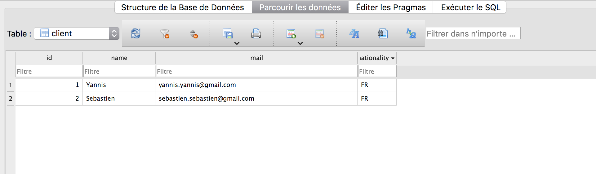
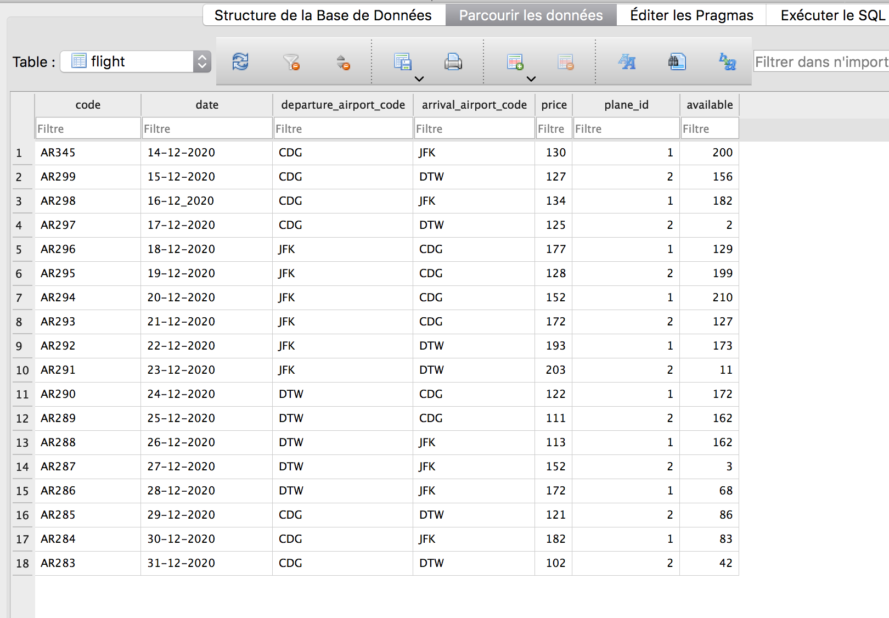
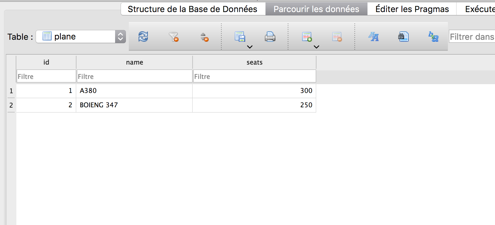
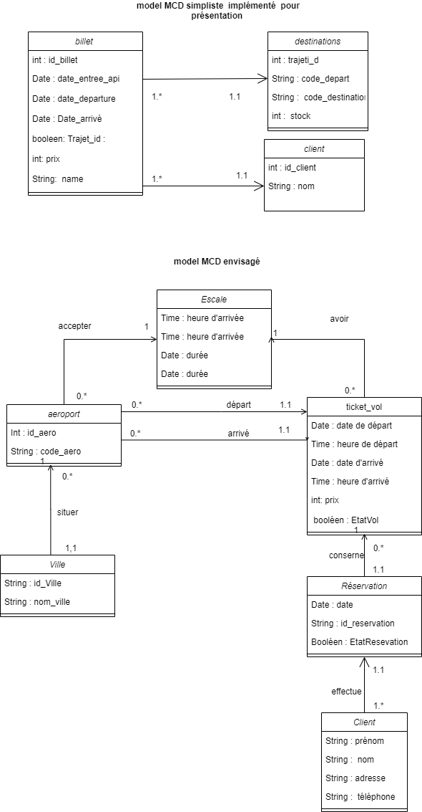

# TP Architecture Distribué

## Démo 

## BDD : Entité du Modèle logique de données implémenté

## Run 

pip install -r requirements.txt

FLASK_APP=main.py flask run

## Architecture

## Stack technique

### Front-end : Jquery (AJAX) + HTML + CSS

### Back-end : Python

Bibliothèque : 

- aniso8601=8.0.0
- click=7.1.2
- Flask=1.1.2
- flask_restful=0.3.8
- flask_sqlalchemy=2.4.3
- flask-cors=3.0.9
- itsdangerous=1.1.0
- Jinja2=2.11.2
- MarkupSafe=1.1.1
- pytz=2020.1
- six=1.15.0s
- flask_sqlalchemy=1.3.18
- Werkzeug=1.0.1

Storage : Base de donné sqlLite

## End point

127.0.0.1:5000/Ticket/<int:Ticket_id> : Post sur le billet avec l'id correspondant on change alors la valeur de la réservation à true et le nom de l'utilisateur

127.0.0.1:5000/Tickets: liste de tous les billets

127.0.0.1:5000/Ticket_id/<int:billet_id>: Afficher le billet avec l'id spécifié

127.0.0.1:5000/Ticket_departure/<int:id_trajet>: liste des billets avec le le lieu de départ spécifié

127.0.0.1:5000/Ticket_entree_api/<string:date_entree_api>: liste des billets ajoutés dans l'api à la date correspondante

127.0.0.1:5000/Ticket_departure_date/<string:date_departure>: liste des billets pour un départ à la date spécifiée

127.0.0.1:5000/Ticket_arrival_date/<string:date_arrival>:liste des billets pour une arrivée à la date spécifiée

127.0.0.1:5000/Ticket_price/<string:price>: liste des billets selon le prix spécifié

## Base de donnée

