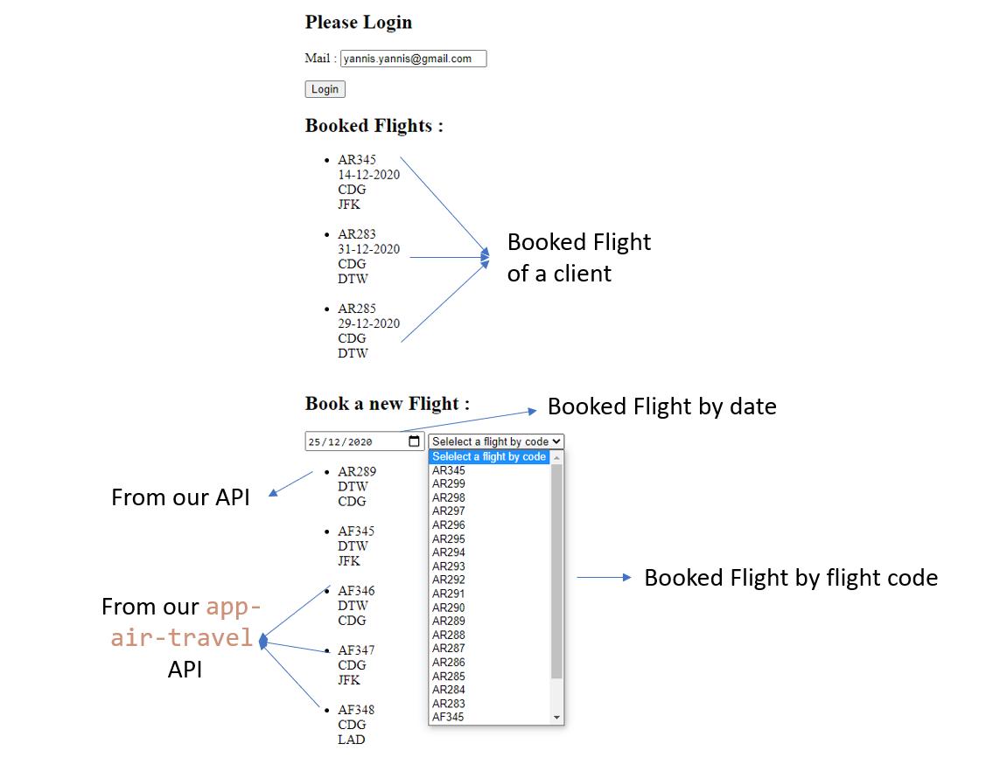
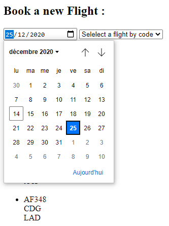

# TP Architecture Distribué

## Démo 

## BDD : Entité du Modèle logique de données implémenté

## Run 

pip install -r requirements.txt

FLASK_APP=main.py flask run

## Architecture

## Stack technique

### Front-end : Jquery (AJAX) + HTML + CSS

### Back-end : Python

Bibliothèque : 

- aniso8601=8.0.0
- click=7.1.2
- Flask=1.1.2
- flask_restful=0.3.8
- flask_sqlalchemy=2.4.3
- flask-cors=3.0.9
- itsdangerous=1.1.0
- Jinja2=2.11.2
- MarkupSafe=1.1.1
- pytz=2020.1
- six=1.15.0s
- flask_sqlalchemy=1.3.18
- Werkzeug=1.0.1

Storage : Base de donné sqlLite

## End point

127.0.0.1:5000/tickets

127.0.0.1:5000/clients

127.0.0.1:5000/book/<string:code>?<string:id>

127.0.0.1:5000/clients/add

127.0.0.1:5000/tickets/date/<string:date>

127.0.0.1:5000/tickets/code/<string:code>

127.0.0.1:5000/clients/<string:mail>

## Base de donnée

